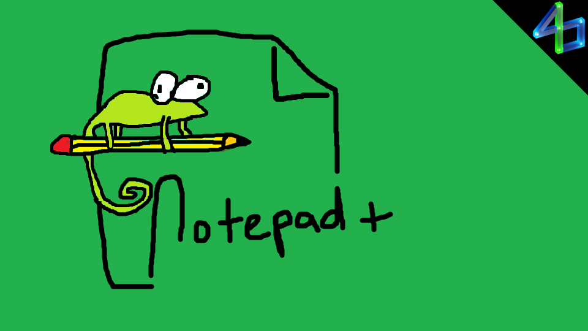

# Notepad+

A simple file explorer and text editor for writing plugins from within the game.

IMPORTANT NOTE: This plugin allows for arbitrary file access on your entire computer. Be cautious with what you decide to delete, rename, etc!

